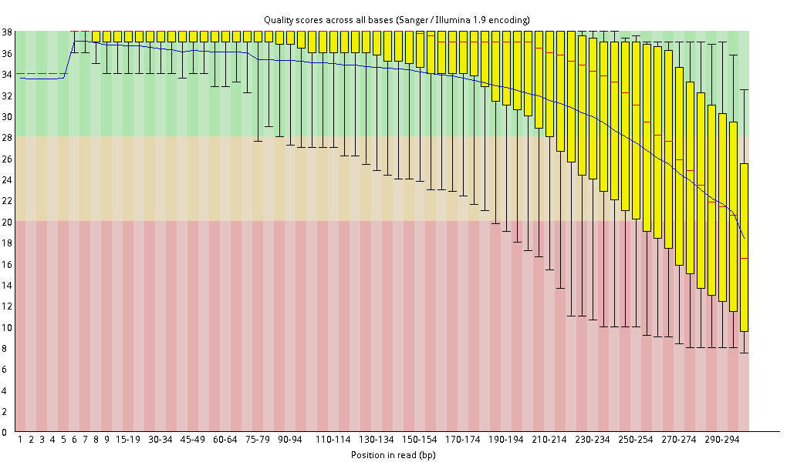

数据分析实践
============

**分析所用数据目录结构**

.. code-block:: bash

   ├── Sample_1
   │   ├── 00_raw
   │   │   └── *.fastq.gz
   │   ├── 01_trimmed
   │   ├── 02_assembly
   │   ├── 03_clean
   │   ├── 10_fasta
   ...
   └── Sample_N
        ├── 00_raw
        ...

**示例所使用数据**

这里用一次 Miseq 测序一个 Run 的数据进行数据质控示例。本次 Run 一共对20个样品进行了 PE300 的测序。产生的测序数据所见如下：

.. code-block:: bash

   $ ls
   RN01_S01_L001_R1_001.fastq.gz    RN06_S06_L001_R1_001.fastq.gz    RN11_S11_L001_R1_001.fastq.gz    RN16_S16_L001_R1_001.fastq.gz
   RN01_S01_L001_R2_001.fastq.gz    RN06_S06_L001_R2_001.fastq.gz    RN11_S11_L001_R2_001.fastq.gz    RN16_S16_L001_R2_001.fastq.gz
   RN02_S02_L001_R1_001.fastq.gz    RN07_S07_L001_R1_001.fastq.gz    RN12_S12_L001_R1_001.fastq.gz    RN17_S17_L001_R1_001.fastq.gz
   RN02_S02_L001_R2_001.fastq.gz    RN07_S07_L001_R2_001.fastq.gz    RN12_S12_L001_R2_001.fastq.gz    RN17_S17_L001_R2_001.fastq.gz
   RN03_S03_L001_R1_001.fastq.gz    RN08_S08_L001_R1_001.fastq.gz    RN13_S13_L001_R1_001.fastq.gz    RN18_S18_L001_R1_001.fastq.gz
   RN03_S03_L001_R2_001.fastq.gz    RN08_S08_L001_R2_001.fastq.gz    RN13_S13_L001_R2_001.fastq.gz    RN18_S18_L001_R2_001.fastq.gz
   RN04_S04_L001_R1_001.fastq.gz    RN09_S09_L001_R1_001.fastq.gz    RN14_S14_L001_R1_001.fastq.gz    RN19_S19_L001_R1_001.fastq.gz
   RN04_S04_L001_R2_001.fastq.gz    RN09_S09_L001_R2_001.fastq.gz    RN14_S14_L001_R2_001.fastq.gz    RN19_S19_L001_R2_001.fastq.gz
   RN05_S05_L001_R1_001.fastq.gz    RN10_S10_L001_R1_001.fastq.gz    RN15_S15_L001_R1_001.fastq.gz    RN20_S20_L001_R1_001.fastq.gz
   RN05_S06_L001_R2_001.fastq.gz    RN10_S10_L001_R2_001.fastq.gz    RN15_S15_L001_R2_001.fastq.gz    RN20_S20_L001_R2_001.fastq.gz

**根据样品建立文件夹**

首先我们对每一个样品的数据单独建立文件夹，并对 fastq 数据进行基本的质控。

.. code-block:: bash

   # 新建以样本名为文件夹名，并移动数据到文件夹的 00_raw 目录下
   $ for i in $(awk -F'L001' '{gsub("_$", "", $1); print $1}' < (ls *.fastq.gz) | sort | uniq ); \
   > do mkdir -p $(basename $i) && mkdir -p $(basename $i)/00_raw; \
   > mv $i*.fastq.gz $(basename $i)/00_raw/ ; done
   # 查看建立的所有文件夹
   $ ls -d
   # 使用 FastQC 对测序数据进行质控分析
   $ for i in $(ls -d RN*/00_raw/*.fastq.gz); do fastqc $i --extract -t 40 -q -o qc; done
   $ python -m SimpleHTTPServer

打开浏览器，访问URL地址为服务器IP:8000，点击qc链接，里面有 fastqc 生成的各测序数据的 html 质控文件。我们以第一个样本 RN01_S01 为例，发现数据有以下问题：

- 250循环之后的数据质量不高（见图1）
- 序列有接头污染（见图2）

|image1|
图1. 长读长区质量不高

|image2|
图2. 接头污染

**去除接头污染**

首先我们要将污染的接头去除，采用 Trimmomatic 进行去除，同时也过滤低质量 reads 序列。

.. code-block:: python

   from fadapa import Fadapa
   from Bio import SeqIO
   from Bio.Seq import Seq
   from Bio.SeqRecord import SeqRecord
   from Bio.Alphabet import generic_nucleotide
   import argparse

   parser = argparse.ArgumentParser()
   parser.add_argument('-i', action=store, dest='qc_file', type=str \
       help='input your fastqc data')
   args = parser.parse_args()

   qc_file = Fadapa(args.qc_file)

   if qc_file.summary()[-3][0] == 'fail':
       adaptors = []
       ors = qc_file.clean_data("Overrepresented sequences")
       ors.pop(0)

       for (index, seq) in enumerate(ors):
           adaptors.append(SeqRecord(Seq(seq[0], generic_nucleotide), id="adaptor_%d" % (index+1), description=""))

       SeqIO.write(adaptors, "adaptor.fasta", "fasta")
       print "Overrepresented sequences has been save to adaptors.fasta"
   else:
       print "No Overrepresented sequences"

上面的 python 脚本使用 Biopython 和 Fadapa 模块将 FastQC 生成的过表达序列保存正接头文件，让 Trimmomatic 进一步处理。

.. code-block:: bash

   $ echo 'alias trimm="java -jar /opt/Trimmomatic-0.36/trimmomatic-0.36.jar"' >> ~/.bashrc
   $ source ~/.bashrc
   $ trimm PE -threads 40 -phred33 \
   > 00_raw/RN01_S01_L001_R1_001.fastq.gz 00_raw/RN01_S01_L001_R2_001.fastq.gz \
   > 01_trim/R1_trimmed.fastq.gz 01_trim/R1_unpaired.fastq.gz \
   > 02_trim/R2_trimmed.fastq.gz 01_trim/R2_unpaired.fastq.gz \
   > ILLUMINACLIP:01_trim/adaptors/adaptor.fasta:2:30:10 \
   > LEADING:3 TRAILING:3 SLIDINGWINDOW:4:15 MINLEN:50

**初步拼接**

先用 spades 进行拼接，了解基因组情况。

.. code-block:: bash

   $ cd RN01_S01/00_raw/
   $ spades.py -k 127 -t 40 --careful -1 01_trim/R1_trimmed.fastq.gz -2 01_trim/R2_trimmed.fastq.gz -o assembly/spades
   $ du -h assembly/spades/scaffolds.fasta
   10.1M    assembly/spades/scaffolds.fasta
   $ cat assembly/spades/scaffolds.fasta | grep '>' | tail -1
   >NODE_3360_....
   $ cat assembly/spades/scaffolds.fasta | grep '>' | awk -F'_' '{if ($6<10) print $0}' | wc -l
   3104

结果获得的 scaffolds.fasta 文件大小为10M左右，而我们测序的目的物种基因组大小仅为3M；里面的 contigs 数量达到3360个，并且 contigs 平均覆盖度小于10的有3100多个，说明原始的测序数据很可能被其他物种污染了。这种污染可能发生在核酸提取，文库制备或者测序中（清洗管路不彻底）

**观察覆盖度与污染序列的关系**

**用 Blast 的方法来筛选污染序列**

.. code-block:: bash

   # 下载污染物种的基因组数据，进行序列比对，看组装的nodes里那些是来源于污染物种。如果有多个污染物种，则可以将基因组数据合并 `cat 1.fa 2.fa 3.fa > containment.fasta`
   $ makeblastdb -db containment.fasta -parse_seqids -db_type nucl
   $ blastn -db containment.fasta -query scaffolds.fasta -max_hsps 1 -outfmt 6 -out result

   # blast 结果的相似性筛选，小于90认为与污染物种不同。将过滤的片段长度求和，判断过滤的片段是否与物种基因组大小一致。如果接近，那么即使有部分片段遗漏，但是大部分基因组数据已经保留。
   $ awk '{ if ($3 < 90) print $1 }' result > filter_nodes
   $ awk -F'_' 'BEGIN {len=0} {len+=$4} END {print len}' filter_nodes

   # 进一步用目的物种的参考基因组进行blast，以确保没有其他物种污染。
   $ makeblastdb -db reference.fasta -parse_seqids -db_type nucl
   $ blastn -db reference.fasta -query assembly.fasta -max_hsps 1 -outfmt 6

**用 Mapping 目的基因组来筛选 reads 再进行拼接**

**抓取目标nodes**

.. code-block:: python

   # 保存代码到 get_nodes.py 文件中，运行　python get_nodes.py
   from Bio import SeqIO

   input_file = 'scaffolds.fasta'
   filter_file = 'filter_nodes'
   output_file = 'assembly.fasta'

   wanted = set(line.rstrip("\n").split(None,1)[0] for line in open(filter_file))
   print "Found %i unique identifiers in %s" % (len(wanted), filter_file)
   records = (r for r in SeqIO.parse(input_file, "fasta") if r.id in wanted)
   count = SeqIO.write(records, output_file, "fasta")
   print "Saved %i records from %s to %s" % (count, input_file, output_file)
   if count < len(wanted):
       print "Warning %i IDs not found in %s" % (len(wanted)-count, input_file)

.. |image2| image:: ../_static/img/appendix/practice/image2.png
